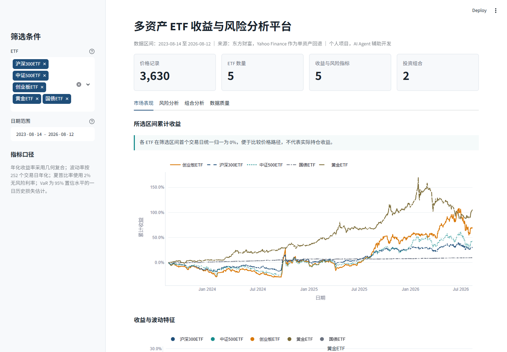

# Multi-Asset Portfolio Analysis

This project downloads adjusted daily prices for five China-listed ETFs from
Eastmoney, checks data quality, measures asset and portfolio risk, constructs
equal-weight and long-only minimum-volatility portfolios, and packages the results
for SQLite analysis and Power BI. Yahoo Finance remains available as a per-asset
fallback if the primary provider fails.

## Interactive Dashboard / 中文在线看板

The recruiter-facing Streamlit dashboard reads only the canonical
`output_verified` package. It presents five ETF return paths, risk metrics,
correlations, equal-weight and minimum-volatility portfolio results, allocation
weights, and data-quality evidence without making live market-data requests.



Run the dashboard from the repository root:

```powershell
python -m pip install -r requirements.txt
python -m streamlit run streamlit_app.py
```

The local page opens at `http://localhost:8501`.

### Deploy on Streamlit Community Cloud

1. Push the latest `main` branch to GitHub.
2. Sign in at [share.streamlit.io](https://share.streamlit.io/) with GitHub and select **Create app**.
3. Set the repository to `2274190244/multi-asset-etf-risk-analysis`.
4. Set the branch to `main` and the entrypoint to `streamlit_app.py`.
5. Select Python 3.12 in Advanced settings, then deploy. No secrets are required.
6. Add the generated `streamlit.app` URL to the GitHub About field and the resume project link.

The root `requirements.txt`, `.streamlit/config.toml`, verified CSV files, and app
entrypoint are included so Community Cloud can build the page directly from GitHub.

## Assets

| Symbol | Exposure |
| --- | --- |
| `510300.SS` | CSI 300 large-cap equity |
| `510500.SS` | CSI 500 mid/small-cap equity |
| `159915.SZ` | ChiNext growth equity |
| `518880.SS` | Gold |
| `511010.SS` | Chinese government bonds |

All five assets are required. Eastmoney is attempted first for each symbol, then
Yahoo Finance is attempted only if that primary request or payload fails. A symbol
that fails with both providers is reported and the command exits without creating
a new analysis package.

## Setup

Python 3.12 or later is recommended.

```powershell
python -m venv .venv
.venv\Scripts\Activate.ps1
python -m pip install -e .
```

Run the offline test suite:

```powershell
$env:PYTEST_DISABLE_PLUGIN_AUTOLOAD = "1"
python -m pytest -v -p no:cacheprovider
```

## One-Command Run

From this directory, build the package using the default trailing three-year
window:

```powershell
python -m portfolio_analysis.cli --output-dir output_20260812
```

An explicit inclusive date range can also be supplied:

```powershell
python -m portfolio_analysis.cli --start 2023-08-12 --end 2026-08-12 --output-dir output_20260812
```

The command prints the computed price-row count, asset count, portfolio count,
and actual observed date range. It returns a nonzero status if any configured
asset is unavailable or analysis cannot complete. Every refresh must use a new,
non-existing versioned destination; add a unique suffix when producing more than
one package on the same date. `output_verified` is the canonical verified package
in this project workspace.

## Outputs

| File | Purpose |
| --- | --- |
| `<versioned_output>/analysis.sqlite` | Queryable `prices`, `asset_metrics`, `portfolio_metrics`, and `portfolio_weights` tables |
| `<versioned_output>/powerbi/prices.csv` | Long daily adjusted-close history by asset |
| `<versioned_output>/powerbi/asset_metrics.csv` | Five annualized and downside metrics by asset |
| `<versioned_output>/powerbi/portfolio_timeseries.csv` | Daily returns, cumulative returns, and 20-trading-day annualized rolling volatility by portfolio |
| `<versioned_output>/powerbi/portfolio_metrics.csv` | Comparable risk metrics by portfolio |
| `<versioned_output>/powerbi/correlation_matrix.csv` | Long-form pairwise return correlations |
| `<versioned_output>/powerbi/portfolio_weights.csv` | Asset allocation by portfolio |
| `<versioned_output>/powerbi/data_quality.csv` | Cleaning counts, coverage, and shared portfolio window |
| `<versioned_output>/resume_facts.json` | Small set of run-derived facts suitable for evidence-backed resume statements |

Successful raw responses are cached under `data/raw/` for traceability. Eastmoney
files use `eastmoney_<symbol>.json`; Yahoo fallback files retain `<symbol>.json`,
so provider payloads cannot overwrite one another. CSV files are written as UTF-8
and can be loaded directly into Power BI.

The nine-file output package is built completely in a unique sibling staging
directory. Only after every CSV, the SQLite database, and `resume_facts.json` are
ready does the pipeline publish staging with a single same-volume, no-replace
directory rename on Windows (`os.rename`). Existing destinations are never
overwritten: a pre-check gives a clear error, while the no-replace rename closes
the check-to-publish race. If building or publishing fails, staging is removed and
any destination that already exists or appears concurrently is left untouched.

## Data Source Disclosure

The primary source is Eastmoney's public historical kline endpoint at
`push2his.eastmoney.com`. Shanghai symbols map to `secid=1.<code>` and Shenzhen
symbols map to `secid=0.<code>`. Requests use daily klines (`klt=101`), forward
adjustment (`fqt=1`), inclusive `beg` and `end` dates, and read the date and close
from fields `f51` and `f53`. The legacy Yahoo chart client and parser are retained
as fallback capability and continue to use adjusted close where available.

The pipeline result metadata records the provider used for each asset. These APIs
are external public services, not project-owned feeds; availability and historical
revisions remain outside this project's control.

## Calculations

- Daily return: `adjusted_close[t] / adjusted_close[t-1] - 1`, with no filling
  across missing prices.
- Annualized return: geometric compound return raised to `252 / observations`.
- Annualized volatility: sample standard deviation of daily returns times
  `sqrt(252)`.
- 20-trading-day rolling volatility: sample standard deviation over each
  portfolio's latest 20 daily returns times `sqrt(252)`. The first 19 portfolio
  observations are intentionally blank because no complete window exists.
- Sharpe ratio: `(annualized return - 2% risk-free rate) / annualized volatility`.
- Maximum drawdown: minimum decline in cumulative wealth from its running peak.
- Historical VaR: positive 95% one-day loss estimate from the empirical fifth
  percentile.
- Equal weight: 20% in each of the five assets.
- Minimum volatility: SciPy SLSQP minimizes portfolio variance subject to long-only
  weights between zero and one that sum to one.
- Correlation: Pearson correlation of synchronized daily returns.

Asset metrics use each asset's available observations. Portfolio construction,
portfolio comparison, and correlation use one shared window created by applying
`dropna` across the wide return matrix for all five assets. This makes every
portfolio date directly comparable and prevents an optimizer from using
different asset histories. If no complete five-asset return row exists, the
pipeline exits with a concise error and does not publish a new package. If
minimum-volatility optimization fails, the valid
equal-weight results are retained, no minimum-volatility weights are exported,
and the failure is recorded in pipeline result metadata.

## AI Agent Collaboration Disclosure

An OpenAI Codex coding agent assisted with requirements interpretation, test-first
implementation, documentation, and verification. The project owner remains
responsible for reviewing the code, validating the live outputs, and presenting
only claims supported by `resume_facts.json` and the SQLite database. No synthetic
fixture results are presented as production evidence.

## Limitations

- Eastmoney and Yahoo Finance are external sources with no availability guarantee;
  symbols, corrections, adjustment methods, and historical prices can change.
- Providers can disconnect requests or enforce rate limits. Production HTTP GETs
  retry connection/read failures and status `429`, `500`, `502`, `503`, and `504`
  at most three times with bounded exponential backoff and `Retry-After` support;
  exhausted retries still fail the asset rather than waiting indefinitely.
- The analysis is historical and does not predict future returns.
- Results exclude transaction costs, taxes, liquidity, tracking error, rebalancing
  turnover, and position-size constraints beyond long-only full investment.
- The fixed 2% risk-free assumption may not match the investment currency or period.
- Complete-case synchronization can shorten the usable portfolio window when any
  asset has a missing observation.
- The five selected ETFs are illustrative and do not represent every investable
  asset or eliminate selection bias.

See [docs/powerbi_build_guide.md](docs/powerbi_build_guide.md) for dashboard
construction and [docs/interview_guide.md](docs/interview_guide.md) for a truthful
project walkthrough.
